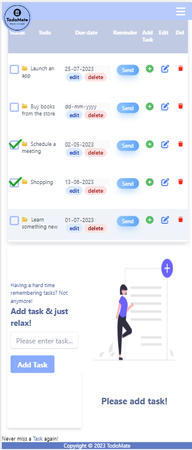

# TodoMate

TodoMate is more than a simple todo-app! 
It's a fully responsive web application that allows you to manage your tasks and keep track of your to-do list. 
It helps you to stay organized and on top of your list. With this app, you can add, update, and delete tasks, mark tasks as completed, and organize them into different categories and much more!

It's full-stack application built using MERN.

## Features

- Create Todo
- Update an existing todo by modifying its title.
- Mark todos as completed to track your progress.
- Delete todo that are no longer needed.
- Sort todos into different categories for better organization.
- Assign due dates and receive reminders for upcoming todos via email.
- Quickly find todo using search and filtering options.
- Add and manage subtasks of todos.

## Technologies used

- Frontend:
  - HTML, CSS
  - React: A JavaScript library for building user interfaces
  - Tailwind CSS: A utility-first CSS framework for quickly styling the UI

- Backend:
  - Node.js: A JavaScript runtime for building server-side applications
  - Express: A web application framework for Node.js
  - MongoDB: A NoSQL database for storing todo data

 
 

### Check out the app by heading over to [TodoMate](https://todomate.onrender.com) 

Or click the link below 

[https://todomate.onrender.com](https://todomate.onrender.com) 

#### Demo video: [User guide](https://drive.google.com/file/d/1Aj1V2R_kYhvOT-MvcGhfPGyBOl5D8Csx/view) 

 
 

### How it appears on different views -

#### Laptop/Desktop 

 
 

#### Mobile 

 
 

### Tablet

